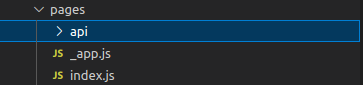
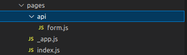

## Form using Next.js API

A walkthrough on how to build a full-stack application using Next.js for both the frontend and the backend. 

The framework provides the API functionality which allows us to build dynamic API's at scale. The API can be used in production with ease and can replace a full fledged backend service for certain business usecases.

Decision to use Next.js API depends on the scale of the system that we are trying to build and I personally think it's a no-brainer for small businesses and MVP's. Another criteria before choosing Next API is to decide if your team can work effectively on a monolith architecture. Below I have listed down some usecases where Next API's can be used:

1. Form submission
2. Gateway/Proxy server
3. UI Theme Provider

Note:
This writeup assumes basic knowledge about building Next.js frontends.

Building API's is similar to building frontends in Next. We put all the API logic inside the `api` folder within the pages folder. Each folder/file within the api folder is a route, similar to how page routing works. Let's see how it looks so far.



Let's start by building an API route `/form`. There are 2 ways to do so, either make a `form.js` file within the api folder or create a `form` folder with an `index.js` file. As you can sense this is exactly similar to how frontend routing works. 




This route is accessible on the same port as the frontend app, and the way to access it is: `http://hostname:port/api/form`

It's time to start coding the logic for `/form`. As repetitive as it can get while coding anything in Next, start by default exporting a function, which acts as the handler for all request on the `/form` route. Note, similar to how vanilla Node.js handles requests, any request on `/form` route irrespective of the HTTP method (GET, POST etc) will be sent to this handler. Let's take a look how the handler looks:

```JavaScript
export default async function handler(req, res) {
  
}
```

- req: An instance of [http.IncomingMessage](https://nodejs.org/api/http.html#class-httpincomingmessage), plus some pre-built middlewares

- res: An instance of [http.ServerResponse](https://nodejs.org/api/http.html#class-httpserverresponse), plus some helper functions

By default (using the default config) following helpers are available:
1. `req.query`: parses the request query params string as object.
2. `req.body`: parses the request body json to object.


Default config can be changed as below:

```JavaScript
export const config = {
  api: {
    bodyParser: false,
  },
};
```

The config disables parsing request json body to object. 

I'll end my intro to Next API's here. To explore more complex usecases, checkout the Next.js documentation [here](https://nextjs.org/docs/api-routes/introduction).

Lastly, I'll leave you with a small example on how to  handle form-data in Next API:

## Handling Form-Data in Next.js API

### Find the GitHub Repository: [here](https://github.com/divinenaman/explore-nextjs/tree/main/form-using-next-api)

```JavaScript
import formidable from "formidable";
import * as yup from "yup";

let formSchema = yup.object().shape({
  name: yup.string().required(),
  email: yup.string().email().required(),
  image: yup.mixed().required(),
});

async function saveFormData(fields, files) {
  // save to persistent data store
}

async function validateFromData(fields, files) {
  try {
    await formSchema.validate({ ...fields, ...files });
    return true;
  } catch (e) {
    return false;
  }
}

async function handlePostFormReq(req, res) {
  const form = formidable({ multiples: true });

  const formData = new Promise((resolve, reject) => {
    form.parse(req, async (err, fields, files) => {
      if (err) {
        reject("error");
      }
      resolve({ fields, files });
    });
  });

  try {
    const { fields, files } = await formData;
    const isValid = await validateFromData(fields, files);
    if (!isValid) throw Error("invalid form schema");

    try {
      await saveFormData(fields, files);
      res.status(200).send({ status: "submitted" });
      return;
    } catch (e) {
      res.status(500).send({ status: "something went wrong" });
      return;
    }
  } catch (e) {
    res.status(400).send({ status: "invalid submission" });
    return;
  }
}

export default async function handler(req, res) {
  if (req.method == "POST") {
    await handlePostFormReq(req, res);
  } else {
    res.status(404).send("method not found");
  }
}

export const config = {
  api: {
    bodyParser: false,
  },
};

```

To parse the form-data in request body, I have used Formidable package which is quite easy to work with. I have also provided a `saveFormData` function which can used to save data on persistent stores like firebase, mongoDB etc.

Next, sending a request to the API from a page:

```JavaScript
async function submitForm(data) {
    const f = new FormData();

    f.append("name", data.name);
    f.append("email", data.email);
    f.append("image", data.image.fileList[0]);

    const res = await fetch("/api/form", {
      method: "POST",
      body: f,
    });

    const resBody = await res.json();

    if (res.status == 200) {
      notification.success({
        duration: 3,
        message: "Submission Status",
        description: resBody.status,
        onClose: () => router.reload(window.location.pathname),
      });
    } else {
      notification.error({
        duration: 2,
        message: "Submission Status",
        description: resBody.status,
      });
    }
  }
```


I'll end here and as I said, the usefulness of Next API depends on the problem you are trying to solve, the scale of the system and collaboration required.

I hope this writeup was useful, have a nice day.

## References

- [Next documentation](https://nextjs.org/docs/api-routes/introduction)
- [Yup](https://github.com/jquense/yup)
- [Formidable](https://github.com/node-formidable/formidable)